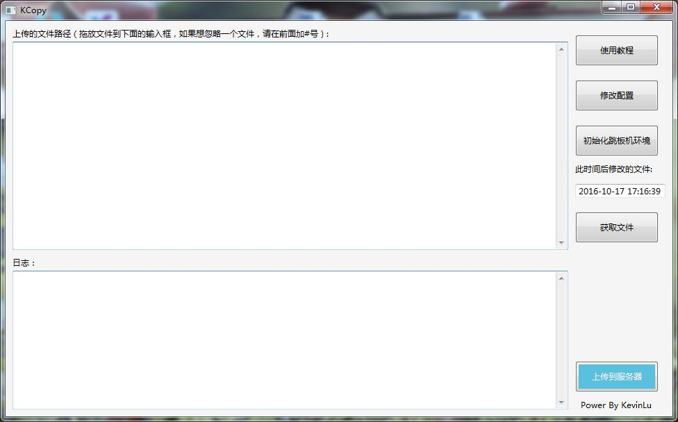

# k_copy
一键同步文件到跳板机，再同步到服务器

# 打包方式
1. 安装py2exe
2. 执行python setup.py py2exe
3. 打包dist目录为一个exe文件
    1. 安装winrar
    2. 在dist中右击，点击添加到压缩文件
    3. 点击“创建自解压格式压缩文件”
    4. 点击高级，点击“自解压选项”
    5. 点击设置，在提取后运行中输入：dist/KCopyMain.exe
    6. 点击模式，选择全部隐藏
    7. 点击更新，选择覆盖所有文件
    8. 点击文本和图标，在自定义徽标和图标中，选择前面制作的bmp文件和ico文件

# 使用教程

## 一、功能介绍
机器角色：
1. 客户端
2. 跳板机
3. 服务端
KCopy功能：把客户端中的文件，复制到跳板机，然后从跳板机复制到服务端

## 二、修改配置
使用前需要点击“修改配置”按钮进行配置设置。需要设置的配置有：
跳板机域名：格式为USER@HOST:PORT，例如kevinlu@192.168.1.1:22
跳板机密码：登录到跳板机的密码
服务器用户名：登录服务器的用户名，例如kevinlu
服务器域名：服务器的IP地址，例如192.168.10.1
服务器密码：服务器用户名对应的密码
服务器端口：登录到服务器的端口，例如22
客户端文件根路径：客户机的文件夹路径，复制到服务端的文件，必须在改文件夹里面
服务器文件根路径：客户机的文件夹对应在服务端的文件夹
服务器文件备份目录：服务器的备份目录，如果复制的时候，服务器一样同样路径的文件，KCopy会将该文件备份在该目录下，文件名：原文件名.时间日期.随机数

假如：
客户端文件根路径=E:/work/
服务器文件根路径=/data/work/
上传的文件路径中填写：
E:/work/test.txt
那么KCopy会将该文件上传到服务器中的路径/data/work/test.txt

## 三、初始化跳板机环境
点击按钮“初始化跳板机环境”KCopy会在跳板机的家目录下建立工作目录k_copy

## 四、上传文件
在“上传的文件路径”输入框中，填入需要上传的文件路径（在客户端的路径）。
然后点击“上传到服务器”。如果想忽略一个文件，请在前面加#号。
可以使用拖动文件的方式，快速输入文件路径。
可以通过“获取文件”按钮来获取在指定时间后被修改过的文件。

